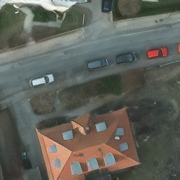
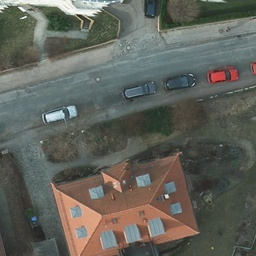
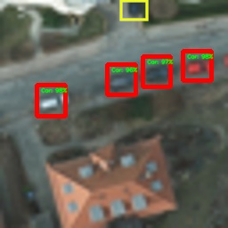
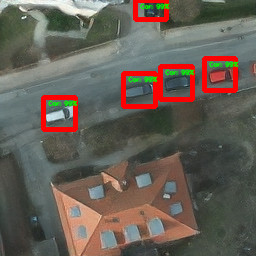
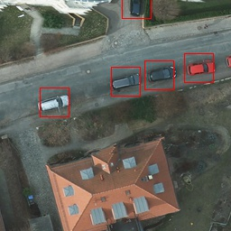
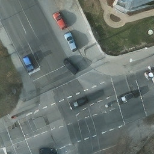
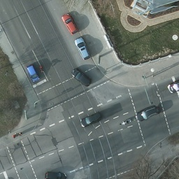
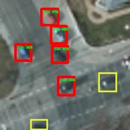
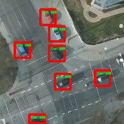
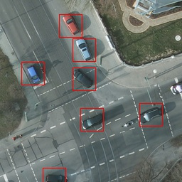

# EESRGAN
## Model Architecture
</img>
## Enhancement and Detection
|Low Resolution <br/> Image & Detection|Super Resolved <br/> Image & Detection|High Resolution Ground Truth <br/> Image & Bounding Box|
| --- | --- | --- |
|</img>|</img>|</img>|
|</img>|</img>|</img>|
|</img>|</img>|</img>|
|</img>|</img>|</img>|
## Dependencies and Installation
- Python 3 (Recommend to use Anaconda)
- PyTorch >= 1.0
- NVIDIA GPU + CUDA
- Python packages: `pip install -r path/to/requirement.txt`
## Training
`python train.py -c config_GAN.json`
## Testing
`python test.py -c config_GAN.json`
## Dataset
Download dataset from [here.](https://gdo152.llnl.gov/cowc/download/cowc-m/datasets/)
[Here](https://github.com/LLNL/cowc/tree/master/COWC-M) is a GitHub repo to create custom image patches.
Download pre-made dataset from [here](https://gdo152.llnl.gov/cowc/download/cowc-m/datasets/DetectionPatches_256x256.tgz) and [this](https://github.com/Jakaria08/EESRGAN/blob/1f93130d8e99166e7bc4d1640329450feec9ff9c/scripts_for_datasets/scripts_GAN_HR-LR.py#L24) script can be used with pre-made dataset to create high/low-resolution and bicubic images. Make sure to copy annotation files (.txt) in the HR, LR and Bic folder.  
## Edit the JSON File
The directory of the following JSON file is needed to be changed according to the user directory. For details see [config_GAN.json](https://github.com/Jakaria08/EESRGAN/blob/master/config_GAN.json) and pretrained weights are uploaded in [google drive](https://drive.google.com/drive/folders/15xN_TKKTUpQ5EVdZWJ2aZUa4Y-u-Mt0f?usp=sharing)
```yaml
{
    "data_loader": {
        "type": "COWCGANFrcnnDataLoader",
        "args":{
            "data_dir_GT": "/Directory for High-Resolution Ground Truth images/",
            "data_dir_LQ": "/Directory for 4x downsampled Low-Resolution images from the above High-Resolution images/"
        }
    },

    "path": {
        "models": "saved/save_your_model_in_this_directory/",
        "pretrain_model_G": "Pretrained_model_path_for_train_test/170000_G.pth",
        "pretrain_model_D": "Pretrained_model_path_for_train_test/170000_G.pth",
        "pretrain_model_FRCNN": "Pretrained_model_path_for_train_test/170000_G.pth",
        "data_dir_Valid": "/Low_resoluton_test_validation_image_directory/"
        "Test_Result_SR": "Directory_to_store_test_results/"
    }
}

```
## Paper
Find the published version on [Remote Sensing](https://www.mdpi.com/2072-4292/12/9/1432).  
Find the preprints of the related paper on [preprints.org](https://www.preprints.org/manuscript/202003.0313/v1), [arxiv.org](https://arxiv.org/abs/2003.09085) and [researchgate.net](https://www.researchgate.net/publication/340095015_Small-Object_Detection_in_Remote_Sensing_Images_with_End-to-End_Edge-Enhanced_GAN_and_Object_Detector_Network).
### Abstract
The detection performance of small objects in remote sensing images has not been satisfactory compared to large objects, especially in low-resolution and noisy images. A generative adversarial network (GAN)-based model called enhanced super-resolution GAN (ESRGAN) showed remarkable image enhancement performance, but reconstructed images usually miss high-frequency edge information. Therefore, object detection performance showed degradation for small objects on recovered noisy and low-resolution remote sensing images. Inspired by the success of edge enhanced GAN (EEGAN) and ESRGAN, we applied a new edge-enhanced super-resolution GAN (EESRGAN) to improve the quality of remote sensing images and used different detector networks in an end-to-end manner where detector loss was backpropagated into the EESRGAN to improve the detection performance. We proposed an architecture with three components: ESRGAN, EEN, and Detection network. We used residual-in-residual dense blocks (RRDB) for both the ESRGAN and EEN, and for the detector network, we used a faster region-based convolutional network (FRCNN) (two-stage detector) and a single-shot multibox detector (SSD) (one stage detector). Extensive experiments on a public (car overhead with context) dataset and another self-assembled (oil and gas storage tank) satellite dataset showed superior performance of our method compared to the standalone state-of-the-art object detectors.
### Keywords
object detection; faster region-based convolutional neural network (FRCNN); single-shot multibox detector (SSD); super-resolution; remote sensing imagery; edge enhancement; satellites
## Related Repository
Some code segments are based on [ESRGAN](https://github.com/xinntao/BasicSR)
## Citation
### BibTex
`@article{rabbi2020small,`\
  `title={Small-Object Detection in Remote Sensing Images with End-to-End Edge-Enhanced GAN and Object Detector Network},`\
  `author={Rabbi, Jakaria and Ray, Nilanjan and Schubert, Matthias and Chowdhury, Subir and Chao, Dennis},`\
  `journal={Remote Sensing},`\
  `volume={12},`\
  `number={9},`\
  `pages={1432},`\
  `year={2020}`\
  `publisher={Multidisciplinary Digital Publishing Institute}`\
`}` 
### Chicago
`Rabbi, Jakaria; Ray, Nilanjan; Schubert, Matthias; Chowdhury, Subir; Chao, Dennis. 2020. "Small-Object Detection in Remote Sensing Images with End-to-End Edge-Enhanced GAN and Object Detector Network." Remote Sens. 12, no. 9: 1432.`  
## To Do 
- Refactor and clean the code.
- Add more command line option for training and testing to run different configuration.
- Fix bug and write important tests. 
