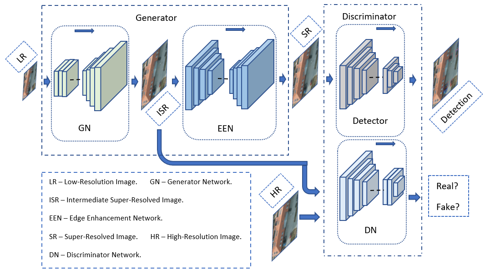
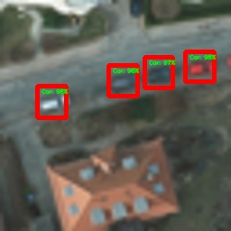
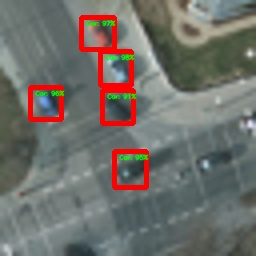

# EESRGAN
## Model Architecture
</img>
## Enhancement and Detection
|Low Resolution <br/> Image & Detection|Super Resolved <br/> Image & Detection|High Resolution Ground Truth <br/> Image & Bounding Box|
| --- | --- | --- |
|</img>|</img>|</img>|
|</img>|</img>|</img>|
|</img>|</img>|</img>|
|</img>|</img>|</img>|
## Dependencies and Installation
- Python 3 (Recommend to use Anaconda)
- PyTorch >= 1.0
- NVIDIA GPU + CUDA
- Python packages: `pip install -r path/to/requirement.txt`
## Training
`python train.py -c config_GAN.json`
## Testing
`python test.py -c config_GAN.json`
## Dataset
Download dataset from [here.](https://gdo152.llnl.gov/cowc/download/cowc-m/datasets/)
[Here](https://github.com/LLNL/cowc/tree/master/COWC-M) is a GitHub repo to create custom image patches.
Download pre-made dataset from [here](https://gdo152.llnl.gov/cowc/download/cowc-m/datasets/DetectionPatches_256x256.tgz) and [this](https://github.com/Jakaria08/EESRGAN/blob/1f93130d8e99166e7bc4d1640329450feec9ff9c/scripts_for_datasets/scripts_GAN_HR-LR.py#L24) script can be used with pre-made dataset to create high/low-resolution and bicubic images.  
## Edit the JSON File
The directory of the following JSON file is needed to be changed according to the user directory. For details see [config_GAN.json](https://github.com/Jakaria08/EESRGAN/blob/master/config_GAN.json) and pretrained weights are uploaded in [google drive](https://drive.google.com/drive/folders/15xN_TKKTUpQ5EVdZWJ2aZUa4Y-u-Mt0f?usp=sharing)
```yaml
{
    "data_loader": {
        "type": "COWCGANFrcnnDataLoader",
        "args":{
            "data_dir_GT": "/Directory for High-Resolution Ground Truth images/",
            "data_dir_LQ": "/Directory for 4x downsampled Low-Resolution images from the above High-Resolution images/"
        }
    },

    "path": {
        "models": "saved/save_your_model_in_this_directory/",
        "pretrain_model_G": "Pretrained_model_path_for_train_test/170000_G.pth",
        "pretrain_model_D": "Pretrained_model_path_for_train_test/170000_G.pth",
        "pretrain_model_FRCNN": "Pretrained_model_path_for_train_test/170000_G.pth",
        "data_dir_Valid": "/Low_resoluton_test_validation_image_directory/"
        "Test_Result_SR": "Directory_to_store_test_results/"
    }
}

```
## Paper
Find the preprints of the related paper on [preprints.org](https://www.preprints.org/manuscript/202003.0313/v1), [arxiv.org](https://arxiv.org/abs/2003.09085) and [researchgate.net](https://www.researchgate.net/publication/340095015_Small-Object_Detection_in_Remote_Sensing_Images_with_End-to-End_Edge-Enhanced_GAN_and_Object_Detector_Network).
### Abstract
The detection performance of small objects in remote sensing images is not satisfactory compared to large objects, especially in low-resolution and noisy images. A generative adversarial network (GAN)-based model called enhanced super-resolution GAN (ESRGAN) shows remarkable image enhancement performance, but reconstructed images miss high-frequency edge information. Therefore, object detection performance degrades for the small objects on recovered noisy and low-resolution remote sensing images. Inspired by the success of edge enhanced GAN (EEGAN) and ESRGAN, we apply a new edge-enhanced super-resolution GAN (EESRGAN) to improve the image quality of remote sensing images and used different detector networks in an end-to-end manner where detector loss is backpropagated into the EESRGAN to improve the detection performance. We propose an architecture with three components: ESRGAN, Edge Enhancement Network (EEN), and Detection network. We use residual-in-residual dense blocks (RRDB) for both the GAN and EEN, and for the detector network, we use the faster region-based convolutional network (FRCNN) (two-stage detector) and single-shot multi-box detector (SSD) (one stage detector). Extensive experiments on car overhead with context and oil and gas storage tank  (created by us from satellite images) data sets show superior performance of our method compared to the standalone state-of-the-art object detectors.
### Keywords
Object detection; faster region-based convolutional neural network (FRCNN); single-shot multi-box detector (SSD); super resolution; remote sensing imagery; edge enhancement; satellites
## Related Repository
Some code segments are based on [ESRGAN](https://github.com/xinntao/BasicSR)
## Citation
`@article{rabbi2020small,`\
  `title={Small-Object Detection in Remote Sensing Images with End-to-End Edge-Enhanced GAN and Object Detector Network},`\
  `author={Rabbi, Jakaria and Ray, Nilanjan and Schubert, Matthias and Chowdhury, Subir and Chao, Dennis},`\
  `journal={arXiv preprint arXiv:2003.09085},`\
  `year={2020}`\
`}` 
## To Do 
- Refactor and clean the code.
- Add more command line option for training and testing to run different configuration.
- Fix bug and write important tests. 
